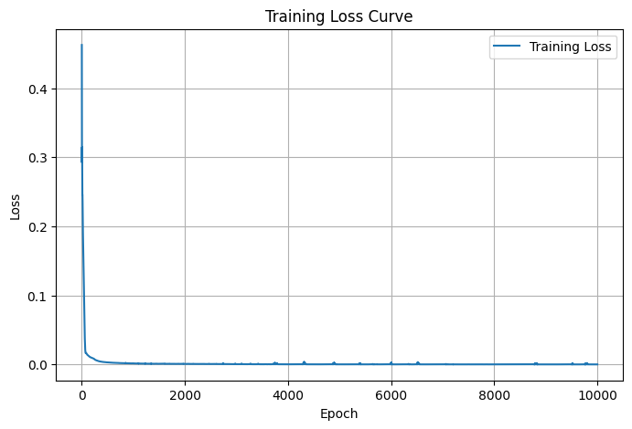

# Surrogate-Modeling-and-Optimization-of-Heat-Loss-using-Neural-Networks
## 📌 Project Overview
This project demonstrates how neural networks can act as surrogate models for engineering optimization problems.

We approximate a **heat loss function** defined by three design parameters (x_1, x_2, x_3), and then use the trained model to perform **gradient-based optimization**.

Instead of solving the function repeatedly, the **surrogate model** provides:

* Fast predictions of heat loss
* A differentiable function suitable for optimization
* A scalable approach applicable to real-world physics-based systems

---

## 🔧 Problem Definition

The heat loss is defined as:

[
Q = \frac{1}{x_1} + \frac{1.5}{x_2} + \frac{2}{x_3}
]

Subject to the constraint:
[
x_3 = 1.5 - 5x_1 - 2.5x_2
]

Where:

* (x_1, x_2, x_3) are design parameters
* (Q) is the heat loss to minimize

---

## 🚀 Methodology

1. **Data Generation**

   * Created a dataset of ((x_1, x_2, x_3, Q)) by sampling across a grid.
   * Applied **normalization** to inputs and outputs for stable training.

2. **Modeling**

   * Built a **surrogate neural network** (PyTorch, 2 hidden layers, ReLU activations).
   * Trained using **MSE Loss + Adam optimizer** for 10,000 epochs.

3. **Optimization**

   * Used the trained NN as a differentiable surrogate.
   * Performed gradient-based optimization on (x_1, x_2) to minimize (Q).
   * Denormalized results to obtain physically interpretable values.

---

## 📊 Results

### Training Performance

The model successfully learned the heat-loss relationship:

* Loss quickly dropped and converged close to **zero**.



### Optimization Logs

During optimization, predicted heat loss gradually reduced:

```
Iteration [500/4000], Predicted Q: 20.6191
Iteration [2000/4000], Predicted Q: 20.3419
Iteration [4000/4000], Predicted Q: 20.4086
```

### Final Optimized Parameters

[
x_1 \approx 0.12, \quad x_2 \approx 0.21, \quad x_3 \approx 0.37
]

With predicted heat loss:
[
Q \approx 20.41
]

---

## 💡 Insights

* **Surrogate modeling** allows replacing expensive simulations with lightweight neural approximations.
* The trained NN captured the nonlinear relationship between parameters and heat loss.
* **Gradient-based optimization** on the surrogate converged to a stable solution.
* This approach can scale to **real-world design problems**, e.g.:

  * Thermal system design
  * Material optimization
  * Aerodynamics & energy efficiency
  * Robotics, where fast physics approximations are required

---

## 🛠️ Requirements

To run this project, install the following dependencies:

```bash
pip install torch matplotlib numpy
```

---

## ▶️ Usage

1. Clone the repository:

   ```bash
   git clone https://github.com/thatboypage/heat-loss-surrogate.git
   cd heat-loss-surrogate
   ```
2. Run the training and optimization script:

   ```bash
   python surrogate_heat_loss.py
   ```
3. View training and optimization results (plots + logs).

---

## 📂 Project Structure

```
├── surrogate_heat_loss.py   # Main script
├── images/
│   └── training_loss.png    # Training curve
└── README.md                # Documentation
```

---

## 🔮 Future Work

* Extend to **physics-informed neural networks (PINNs)**
* Compare with **LSTM-based surrogates** for sequential optimization
* Apply to **real engineering datasets** (CFD, material design, robotics sensors)

---

## 🤝 Contribution

Feel free to fork, open issues, and submit pull requests to improve this project.

---
